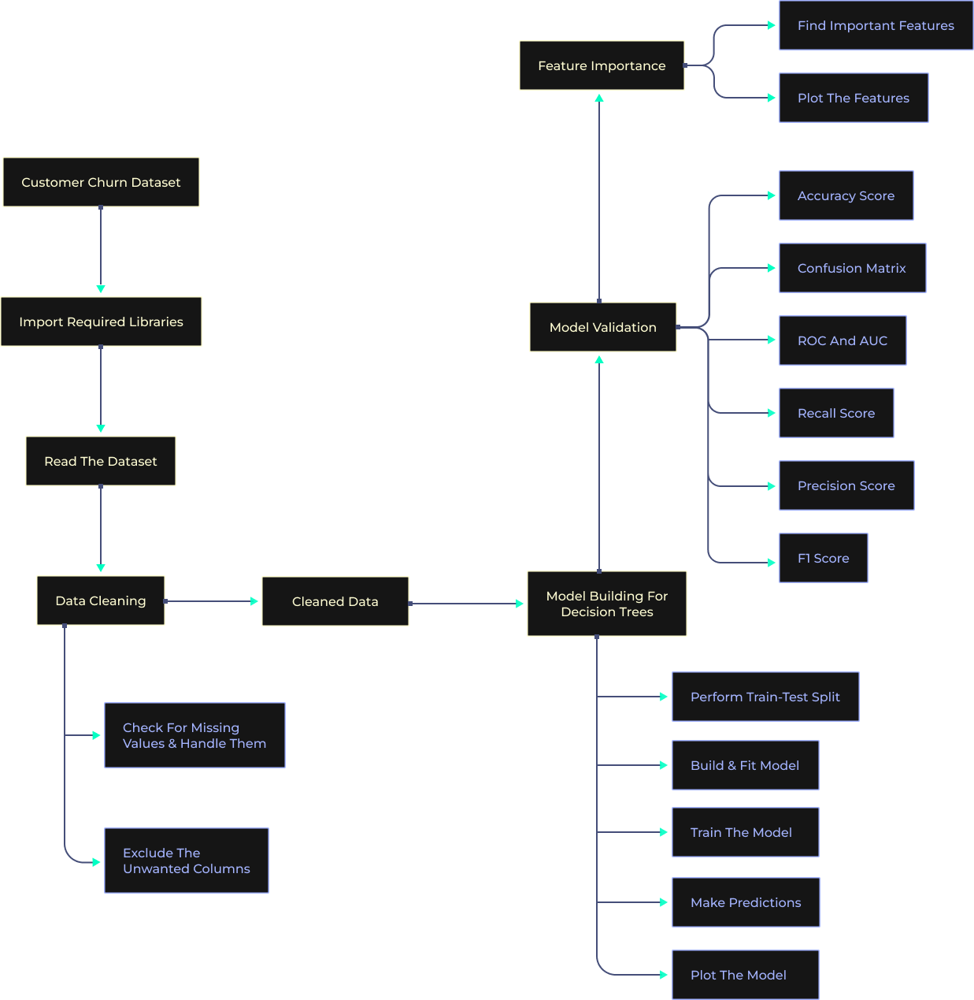

# Business Objective

A Decision Tree is a Supervised learning technique that can be used for both classification and regression problems, but mostly it is preferred for solving Classification problems. It is a tree-structured classifier, where internal nodes represent the features of a dataset, branches represent the decision rules, and each leaf node represents the outcome.

It is a graphical representation of all possible solutions to a problem/decision based on given conditions. It is called a decision tree because similar to a tree, it starts with the root node, which expands on further branches and constructs a tree-like structure. A decision tree asks a question and based on the answer (Yes/No), it further splits the tree into subtrees.

In this case study,I will be working on a churn dataset. Churned Customers are those who have decided to end their relationship with their existing company.

XYZ is a service-providing company that provides customers with a one-year subscription plan for their product. The company wants to know if the customers will renew the subscription for the coming year or not.

I have already shown how the logistics regression model works on this dataset.

Now, I will try to fit the decision tree classifier on the given dataset.

## Data Description 

This data provides information about a video streaming service company, where they want to predict if the customer will churn or not. The CSV consists of around 2000 rows and 16 columns.

## Aim

Build a decision tree learning model on the given dataset to determine whether the customer will churn or not.

