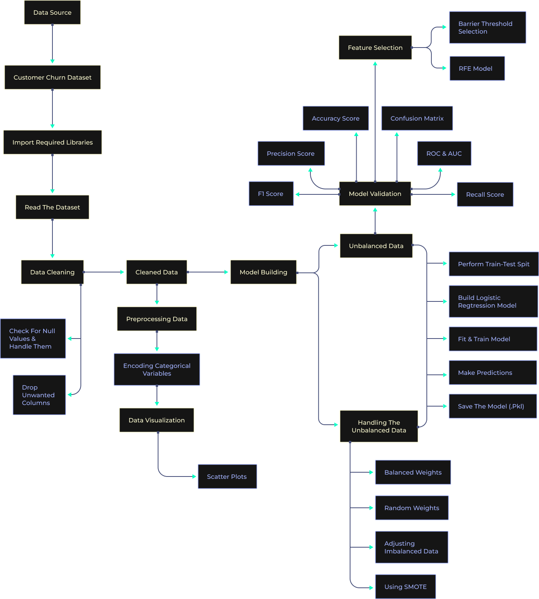

# Business Objective

Predicting a qualitative response for observation can be referred to as classifying that observation since it involves assigning the observation to a category or class. Classification forms the basis for Logistic Regression. Logistic Regression is a supervised algorithm used to predict a dependent variable that is categorical or discrete. Logistic regression models the data using the sigmoid function.

Churned Customers are those who have decided to end their relationship with their existing company. In our case study, we will be working on a churn dataset.

XYZ is a service-providing company that provides customers with a one-year subscription plan for their product. The company wants to know if the customers will renew the subscription for the coming year or not.

 

## Data Description 

This data provides information about a video streaming service company, where they want to predict if the customer will churn or not. The CSV consists of around 2000 rows and 16 columns.

 

## Aim

Build a logistics regression learning model on the given dataset to determine whether the customer will churn or not.

